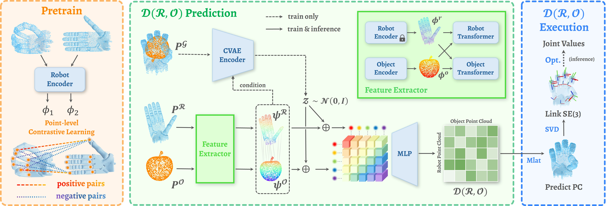

# $\mathcal{D(R,O)}$ Grasp

Official Code Repository for **$\mathcal{D(R,O)}$ Grasp: A Unified Representation of Robot and Object Interaction for Cross-Embodiment Dexterous Grasping**.

[Zhenyu Wei](https://zhenyuwei2003.github.io/)<sup>1,2\*</sup>, [Zhixuan Xu](https://ariszxxu.github.io/)<sup>1\*</sup>, [Jingxiang Guo](https://borisguo6.github.io)<sup>1</sup>, [Yiwen Hou](https://houyiwen.github.io/)<sup>1</sup>, [Chongkai Gao](https://chongkaigao.com/)<sup>1</sup>, Zhehao Cai<sup>1</sup>, Jiayu Luo<sup>1</sup>, [Lin Shao](https://linsats.github.io/)<sup>1</sup>

<sup>1</sup>National University of Singapore, <sup>2</sup>Shanghai Jiao Tong University

<sup>*</sup> denotes equal contribution

<p align="center">
    <a href='https://arxiv.org/abs/2410.01702'>
      
    </a>
    <a href='https://arxiv.org/pdf/2410.01702'>
      
    </a>
    <a href='https://nus-lins-lab.github.io/drograspweb/'>
      
    </a>
</p>
<div align="center">
  
</div>


In this paper, we present $\mathcal{D(R,O)}$ Grasp, a novel framework that models the interaction between the robotic hand in its grasping pose and the object, enabling broad generalization across various robot hands and object geometries. Our model takes the robot hand’s description and object point cloud as inputs and efficiently predicts kinematically valid and stable grasps, demonstrating strong adaptability to diverse robot embodiments and object geometries.

----------------

## Prerequisites:

- Python 3.8
- PyTorch >= 2.3.0

## Get Started

### 1. Create Python Environment

```bash
conda create -n dro python==3.8
conda activate dro
```

### 2. Install Isaac Gym Environment (Optional)

You don't need to install Isaac Gym for training and pretraining. If evaluating grasps in Isaac Gym isn't required, you can skip this step.

Download [Isaac Gym](https://developer.nvidia.com/isaac-gym/download) from the official website, then:

```bash
tar -xvf IsaacGym_Preview_4_Package.tar.gz
cd isaacgym/python
pip install -e .
```

### 3. Install Packages

Change the project directory, then run:

```bash
pip install -r requirements.txt
```

### 4. Weights & Biases (Optional)

This project use Weights & Biases to monitor loss curves. If you're not familiar with it, refer to the [W&B Tutorials](https://docs.wandb.ai/tutorials/) if you haven't used before. Alternatively, you can disable the related sections in `train.py` and `pretrain.py`.

## Example

Download our [checkpoint models](https://github.com/zhenyuwei2003/DRO-Grasp/releases/tag/v1.0) and unzip the contents into the `ckpt/` folder, or simply execute:

```bash
bash scripts/download_ckpt.sh
```

To verify that the Isaac Gym environment is correctly installed and to evaluate the performance of our model, run `python scripts/example_isaac.py`. You can also run `python scripts/example_pretrain.py` to obtain the matching order of our pretrained model, which is a good indicator of its effectiveness. You can visualize the correspondence matching results by running `python visualizatino/vis_pretrain.py`.

## How to use?

### Pretraining

You need to modify the configuration file based on your requirements. Below are the key parameters commonly adjusted in the `config/` folder:

- `pretrain.yaml`
    - `name`: Specify the pretraining model name.
    - `gpu`: Set the GPU ID based on the available GPU device(s).
    - `training/max_epochs`: Define the number of pretraining epochs.
- `dataset/pretrain_dataset.yaml`
    - `robot_names`: Provide the list of robot names to be used for pretraining.

After updating the config file, simply run:

```bash
python pretrain.py
```

To assess the performance of the pretrained model, which is best indicated by lower matching order values, you can run the following command:

```bash
python scripts/pretrain_order.py \
  --pretrain_ckpt pretrain_3robots \      # specify your model name
  --data_num 200 \                          # number of grasps for one robot
  --epoch_list 10,20,30,40,50 \             # epochs of the pretrained model you want to test
  --robot_names barrett,allegro,shadowhand  # list of robots
```

### Training

You need to modify the configuration file based on your requirements. Below are the key parameters commonly adjusted in the `config/` folder:

- `train.yaml`
    - `name`: Specify the training model name.
    - `gpu`: Set the GPU ID based on the available GPU device(s).
    - `training/max_epochs`: Define the number of training epochs.
- `model.yaml`
    - `pretrain`: Specify the name of the pretrained model, which should be placed in the `ckpt/` folder.
- `dataset/cmap_dataset.yaml`
    - `robot_names`: Provide the list of robot names to be used for pretraining.
    - `batch_size`: Set the dataloader batch size as large as possible. Note that a batch size of 1 will roughly consume 4 GB of GPU memory, and it cannot be set to 1 during training due to batch normalization requirements.
    - `object_pc_type`: Use `random` for major experiments and `partial` for partial object point cloud input. This parameter should remain the same during training and validation.

After updating the config file, simply run:

```
python train.py
```

### Validation

You need to modify the configuration file based on your requirements. Below are the key parameters commonly adjusted in the `config/` folder:

- `validate.yaml`
    - `name`: Specify the model name you want to validate.
    - `gpu`: Set the GPU ID based on the available GPU device(s).
    - `split_batch_size`: Set the number of grasps to run in parallel in Isaac Gym, constrained by GPU memory. Maximize this value to speed up the validation process.
    - `validate_epochs`: Specify the list of epochs of the trained model to validate.
    - `dataset/batch_size`: The total number of grasps for each `(robot, object)` combination to validate.
- `dataset/cmap_dataset.yaml`
    - `robot_names`: Provide the list of robot names to be used for validation.
    - `batch_size`: Overwritten by `validate.yaml`, ignored.
    - `object_pc_type`: Keep this the same as during training.

After updating the config file, simply run:

```
python validate.py
```

## Dataset

You can download our filtered dataset, URDF files and point clouds [here](https://github.com/zhenyuwei2003/DRO-Grasp/releases/tag/v1.0) and unzip the contents into the `data/` folder, or simply execute:

```bash
bash scripts/download_data.sh
```

The original `MultiDex` and `CMapDataset` are also included for pretraining purposes. For more details on these datasets, refer to [GenDexGrasp](https://github.com/tengyu-liu/GenDexGrasp).

## Repository Structure

```bash
DRO-Grasp
├── ckpt  # Checkpoint models stored here
├── configs  # Configuration files
├── data  # Datasets downloaded and stored here
├── data_utils  # Dataset classes and related scripts
├── model  # Network architecture code
├── output  # Saved model checkpoints and log files
├── tmp  # Temporary files generated during subprocess execution
├── scripts
│   ├── download_ckpt.sh  # Download checkpoint models
│   ├── download_data.sh  # Download data
│   ├── example_isaac.py  # Test Isaac Gym environment and evaluate our model's performance
│   ├── example_pretrain.py  # Evaluate our pretrained model's performance
│   └── pretrain_order.py  # Evaluate performance of pretrained model
├── utils  # Various utility scripts
├── validate  # Scripts for validating in Isaac Gym
├── validate_output  # Validation results saved here
├── vis_info  # Visualization information saved during validation
└── visualization
│   ├── vis_controller.py  # Visualize the effect of the grasp controller
│   ├── vis_dataset.py  # Visualize grasps from the dataset
│   ├── vis_hand_joint.py  # Visualize hand joint movements
│   ├── vis_hand_link.py  # Visualize hand links
│   ├── vis_pretrain.py  # Visualize pretrain matching results
│   └── vis_validation.py  # Visualize validation results    
├── pretrain.py  # Main scripts for pretraining
├── train.py     # Main scripts for training
└── validate.py  # Main scripts for validation
```

## Steps to Apply our Method to a New Hand

1. Modify your hand's URDF. You can refer to an existing URDF file for guidance on making modifications.
    - Add virtual joints between the world and the robot to represent the base link transform.  Ensure these joint names start with `virtual` so the controller can ignore them.
    - Use `visualization/vis_optimization.py` to view the optimization result. If no fixed joint exists at the tip links, the optimized point cloud may not align with the target point cloud at those links. In this case, add extra links beyond each tip link and ensure their names begin with `extra` so their transforms are processed before optimization.
2. Add the hand's URDF and mesh paths to `data/data_urdf/robot/urdf_assets_meta.json`
3. Specify redundant link names in `data_utils/remove_links.json`. You can visualize the links using `visualization/vis_hand_link.py` to identify which links are irrelevant for contact.
4. Use `data_utils/generate_pc.py` to sample point clouds for each robot link and save them.
5. Annotate the `link_dir` for all links in the `get_link_dir()` function of `utils/controller.py`. You can adjust the direction of each link using `vis_hand_direction()` in `visualization/vis_controller.py`, ensuring that the arrow points in the correct direction of motion when the joint value increases.
6. Pretrain and train the model using your own grasp dataset.

## Citation

If you find our codes or models useful in your work, please cite [our paper](https://arxiv.org/abs/2410.01702):

```
@article{wei2024dro,
    title={D(R,O) Grasp: A Unified Representation of Robot and Object Interaction for Cross-Embodiment Dexterous Grasping},
    author={Wei, Zhenyu and Xu, Zhixuan and Guo, Jingxiang and Hou, Yiwen and Gao, Chongkai and Cai, Zhehao and Luo, Jiayu and Shao, Lin},
    journal={arXiv preprint arXiv:2410.01702},
    year={2024}
}
```

## Contact

If you have any questions, feel free to contact me through email ([Zhenyu_Wei@sjtu.edu.cn](mailto:Zhenyu_Wei@sjtu.edu.cn))!
